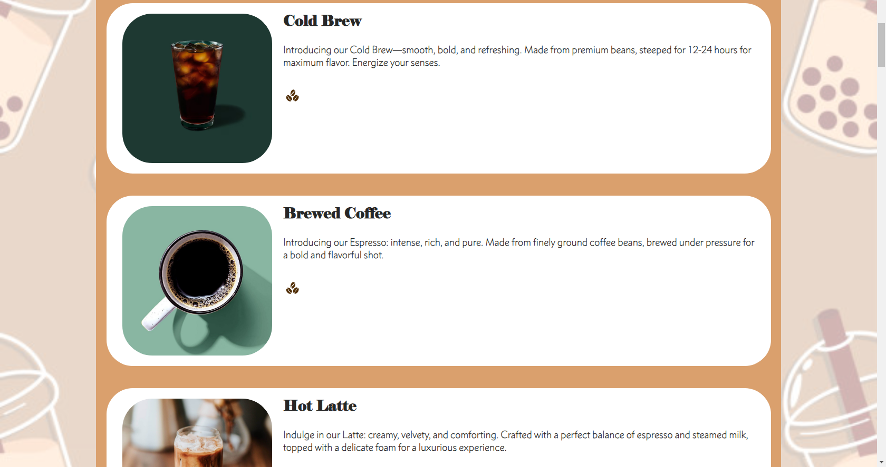

# AWSBobaWebApp
Dynamic website made for online ordering and information about the Boba shop.  It has a Menu, Online Ordering page, About page, Location, and Home page.  See the photos below for the latest updates to the UI.  I use React JS and the semantic ui package for the components.  I use IntelliJ as my IDE as I code and commit to my branches.  

To start this app:

1) Clone to desktop and open in your IDE choice or Git

2) Run the following command in terminal
```npm install```
```npm start```


Dependencies: 
```npm install```
```npm install react-bootstrap```
```npm install --save react-router-dom```
```npm install semantic-ui```
```npm install --save stripe```
```npm install --save @stripe/react-stripe-js @stripe/stripe-js```

# Website UI: 
The images below are the most updated UI right now in the main branch.  

# Home Page


# Menu Page





# Online Ordering Page


# About Us Page


# Location Page


# Shopping Cart Page


